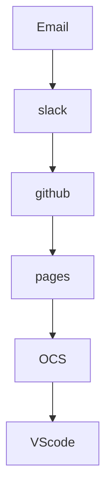
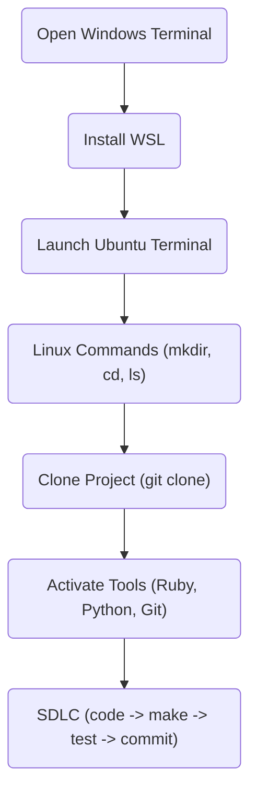
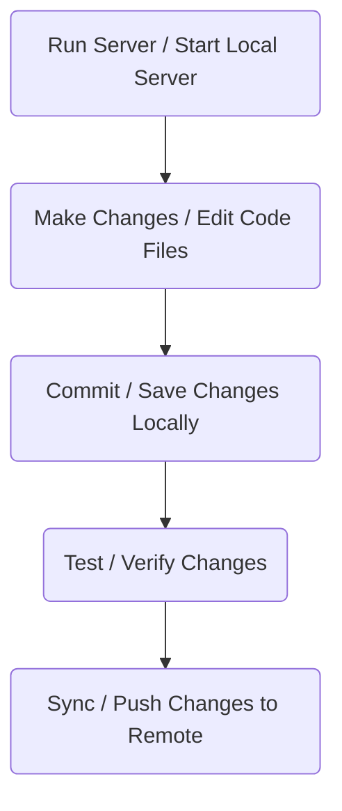

## My Journey Through Computer Science 

Account creations:

## Steps of setting up everything up together!:

Making repository, making issues, making accounts, publishing sites. 

<comment> While making it was somewhat easy, I struggled on these parts
 </comment> 

 

   
  
  
   
  
  
   

### Downloading everything on the computer and making the homepage/all about me:

#### What I learned in the SDLC Workflow

#### Creating the all about me  

The all about me mainly focused on what I've done in life! I've focused on a wide array of things such what I've done. I mainly struggled on the images however! However, I quickly learned how to work with them. They arent my favorite thing. 

As you can tell, I really love sports! I mainly do dance, ice skating and tennis however.

I dont love studying as much but I have had my fair share in it! I did Sci Oly the longest but quit going into High School. I'm student coaching though!
